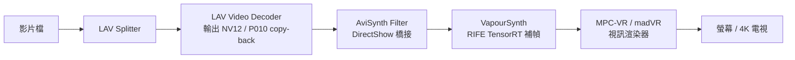

# fps-up-VapourSynth-RIFE

🎬 **基於 VapourSynth + RIFE 深度學習架構的即時電影/動畫補幀播放管線配置指南 (Windows)**

這是一份完整的**從零開始（從空白系統到完美運作）**配置指南。本教學整合了所有除錯與調優經驗，旨在構建一條具備 **HDR 支援**、**TensorRT 硬體加速**、**防止電視外接快轉**、**色彩與比例精確保真**的極致 RIFE 即時補幀播放管線。

---

## 📑 目錄

- [1. 架構原理與硬體環境要求](#1-架構原理與硬體環境要求)
- [2. 第一階段：必備底層元件與相依環境安裝](#2-第一階段必備底層元件與相依環境安裝)
- [3. 第二階段：Python、VapourSynth 與 TensorRT 環境配置](#3-第二階段pythonvapoursynth-與-tensorrt-環境配置)
- [4. 第三階段：AviSynth Filter 橋接濾鏡安裝與註冊](#4-第三階段avisynth-filter-橋接濾鏡安裝與註冊)
- [5. 第四階段：MPC-BE 播放器安裝與關鍵設定](#5-第四階段mpc-be-播放器安裝與關鍵設定)
- [6. 第五階段：部署 VapourSynth RIFE 即時補幀腳本](#6-第五階段部署-vapoursynth-rife-即時補幀腳本)
- [7. 第六階段：播放驗證與常見故障排查 (Troubleshooting)](#7-第六階段播放驗證與常見故障排查-troubleshooting)

---

## 1. 架構原理與硬體環境要求

### 資料流運作管線 (Dataflow Pipeline)



$$\text{影片檔} \to \text{LAV Splitter} \to \text{LAV Video Decoder (輸出 NV12/P010)} \to \mathbf{AviSynth\ Filter} \to \mathbf{VapourSynth (RIFE TRT 補幀)} \to \text{MPC-VR / madVR (渲染器)} \to \text{螢幕/電視}$$

### 硬體與系統建議
- **作業系統**：Windows 10 / 11 64-bit。
- **顯示卡**：NVIDIA GeForce RTX 20 / 30 / 40 / 50 系列（建議顯存 $\ge 6\text{GB}$；4K 即時補幀建議 RTX 3070 / 4070 以上）。
- **驅動程式**：請至 NVIDIA 官網安裝最新 Game Ready 或 Studio 驅動程式。

---

## 2. 第一階段：必備底層元件與相依環境安裝

在安裝播放器之前，請務必先安裝好 Windows 底層運行庫：

1. **Microsoft Visual C++ 2015–2022 Redistributable (x64)**：
   前往微軟官方下載並安裝 [vc_redist.x64.exe](https://aka.ms/vs/17/release/vc_redist.x64.exe)。
2. **CUDA Toolkit 與 cuDNN**：
   建議使用 CUDA 12.x 系列（若使用 TensorRT 整合套件或預編譯輪子，請確保版本對齊）。

---

## 3. 第二階段：Python、VapourSynth 與 TensorRT 環境配置

> [!IMPORTANT]
> **重要原則**：整個播放管線的所有元件必須統一為 **64-bit (x64)**，不可混用 32-bit。

### 步驟 3.1：安裝 64-bit Python
下載並安裝 Python 3.10 或 3.11 64-bit（推薦 3.11.x，套件相容性最佳；亦相容 3.12）：
- [Python 官方下載頁面](https://www.python.org/downloads/)
- 安裝時務必勾選：
  - `[x] Add Python to PATH`
  - `[x] Install for all users`（建議路徑保持簡潔，例如 `C:\Program Files\Python311` 或預設路徑）

> [!WARNING]
> 切勿安裝 Python 3.13 或更高版本！PyTorch 與 TensorRT 的 Windows 預編譯輪子尚未完全適配，會導致安裝時出現 `No matching distribution found` 錯誤。

### 步驟 3.2：安裝 VapourSynth
1. 前往 [VapourSynth GitHub Releases](https://github.com/vapoursynth/vapoursynth/releases) 下載最新的 Windows 安裝包（例如 `VapourSynth-Rxx.exe`）。
2. 執行安裝程式，安裝時勾選安裝對應的 Python 模組。

### 步驟 3.3：安裝 vsrife 與 TensorRT 依賴
打開 Windows「終端機 (Windows Terminal)」或「命令提示字元 (cmd)」，執行以下指令：

```powershell
# 1. 升級 pip
python -m pip install --upgrade pip

# 2. 安裝 PyTorch (CUDA 12.x 版本)
pip install torch torchvision --index-url https://download.pytorch.org/whl/cu121

# 3. 安裝 TensorRT Python 模組
pip install tensorrt

# 4. 安裝 HolyWu 開發的 vs-rife 濾鏡核心
pip install vsrife

# 5. 檢查 VapourSynth 是否成功識別 vsrife
python -c "import vapoursynth as vs; from vsrife import rife; print('VapourSynth RIFE 安裝成功！')"
```

---

## 4. 第三階段：AviSynth Filter 橋接濾鏡安裝與註冊

**AviSynth Filter** 是將 DirectShow 視訊流傳送給 VapourSynth 處理的關鍵橋樑。

1. **下載濾鏡**：
   前往 [AviSynth Filter GitHub Releases](https://github.com/crendking/avisynth_filter/releases) 下載最新的發行壓縮包（例如 `AviSynthFilter-vX.X.X.zip`）。
2. **解壓縮與放置**：
   將壓縮包解壓縮至一個固定且不會被隨意刪除的目錄，例如：`C:\Program Files\AviSynth Filter\`。
3. **以管理員身分註冊 DirectShow 濾鏡**：
   - 進入該資料夾，找到 `install.cmd` 或 `register_filter.bat`。
   - 按右鍵 $\to$ **「以系統管理員身分執行」**。
   - 若彈出對話框提示 `DllRegisterServer in AviSynthFilter.dll succeeded`，即代表註冊成功。

---

## 5. 第四階段：MPC-BE 播放器安裝與關鍵設定

### 步驟 5.1：安裝 MPC-BE 與視訊渲染器
1. **MPC-BE**：
   前往 [MPC-BE 官方網站 / SourceForge](https://sourceforge.net/projects/mpcbe/) 下載並安裝 64-bit 版本。
2. **視訊渲染器 (MPC Video Renderer - 簡稱 MPC-VR)**：
   - 前往 [MPC Video Renderer GitHub Releases](https://github.com/Aleksoid1978/VideoRenderer/releases) 下載最新版壓縮包。
   - 解壓縮至固定資料夾（例如 `C:\Program Files\MPC Video Renderer\`）。
   - 右鍵管理員身分執行 `Install_MPCVR_64.cmd` 完成註冊。

### 步驟 5.2：配置 MPC-BE 視訊解碼與輸出格式
打開 MPC-BE，按鍵盤 <kbd>O</kbd> 鍵進入「選項 (Options)」視窗：

1. **指定視訊渲染器**：
   - 導航至 **視訊 (Video)**。
   - 在「視訊渲染器 (Video Renderer)」下拉選單中，選擇 **MPC Video Renderer**（或 madVR）。
2. **解碼格式直通設定（關鍵：避免 YUV420 降採樣或色度失真）**：
   - 導航至 **內部濾鏡 (Internal Filters)** $\to$ **視訊解碼器 (Video Decoders)** $\to$ 點擊右下角 **視訊解碼器設定 (Video decoder configuration)**。
   - 在硬體加速部分：
     - **Hardware Acceleration**：選擇 **D3D11** 或 **DXVA2 (copy-back)**。
     > [!CAUTION]
     > **注意：絕不可選擇 Native 模式！** Native 模式下解碼幀直接保留在顯卡 VRAM 渲染鏈路中，無法將解碼後的幀截獲傳送給 AviSynth Filter 處理。
     - 確保勾選支援的輸出色深包含 **NV12 (8-bit)** 與 **P010 (10-bit HDR)**。

### 步驟 5.3：掛載 AviSynth Filter 到外部濾鏡清單
1. 在 MPC-BE「選項」視窗中，導航至 **外部濾鏡 (External Filters)**。
2. 點擊右側的 **「新增濾鏡... (Add Filter...)」**。
3. 在彈出清單中找到 **AviSynth Filter**（若清單中未顯示，可點擊「瀏覽...」手動指向 `AviSynthFilter.dll`）。
4. 選取 AviSynth Filter 後，將右側單選鈕設為 **「偏好 (Prefer)」**。
5. 點擊「套用 (Apply)」並按「確定」。

---

## 6. 第五階段：部署 VapourSynth RIFE 即時補幀腳本

### 步驟 6.1：在 AviSynth Filter 中設定腳本路徑
1. 開啟任一影片播放，在 MPC-BE 畫面按右鍵 $\to$ **濾鏡 (Filters)** $\to$ 點擊 **AviSynth Filter** 開啟設定頁。
2. 切換至 **Settings** 分頁：
   - **Script Engine**：選擇 **VapourSynth**。
   - **Input formats**：勾選 `NV12`、`P010`、`YV12` 等主流格式。
3. **指定腳本路徑**：
   - 在 AviSynth Filter 的腳本路徑欄位指向本專案的腳本檔案，例如：
     - 自動動態刷新率旗艦版：[`interpolate_auto.vpy`](interpolate_auto.vpy)
     - 輕量固定倍率版：[`interpolate_base.vpy`](interpolate_base.vpy)

### 步驟 6.2：本專案腳本選擇與核心特性

本專案倉庫已內建完整調優的 VapourSynth 補幀腳本：

| 腳本檔案 | 適用場景 | 核心特色 |
| :--- | :--- | :--- |
| [`interpolate_auto.vpy`](interpolate_auto.vpy) | 旗艦推薦（日常觀影、高刷螢幕、電視外接） | 自動偵測螢幕刷新率、整數倍防抖、HDR/SAR 元數據保真、GPU 負載保護、TRT 預編譯檢測自動退回 CUDA、可選 MVTools 混合管線 |
| [`interpolate_base.vpy`](interpolate_base.vpy) | 精簡穩定（專注固定倍率或低資源消耗） | 固定 48 / 60 / 120 / 144 fps 目標模式切換、極簡直通、秒開秒播 |

#### 關鍵參數配置速查：
- `RUN_MODE`: `"AUTO"`（自適應螢幕 Hz 並以整數倍無抖動對齊）或 `"FIXED"`（固定倍率）。
- `FIXED_FPS_FACTOR`: FIXED 模式倍率，例如 `2`（2倍）、`(5, 2)`（2.5倍補至60fps）。
- `MAX_FACTOR`: AUTO 模式下的最大倍率預算（預設 `2`，保護顯卡負載；如需 120Hz/240Hz 滿幀可調為 `5`）。
- `MODEL`: 預設推薦 `"4.25"`（抗大動態撕裂能力最佳，初次載入會自動下載模型權重）。
- `USE_TRT`: `True` 開啟 TensorRT 加速（大幅降低 GPU 功耗與負載）；若設為 `False` 則為純 CUDA 模式。
- `ENABLE_SCENE_DETECT`: 場景變更防撕裂檢測（預設 `False` 即可流暢秒開秒播）。
- `AUTO_DOWNSCALE_4K`: `True` 啟用超高清降採樣推論，避免 4K 片源即時補幀顯存溢出。
- `BYPASS_HIGH_FPS`: `True` 原生幀率 $\ge 48\text{fps}$ 時自動直通不補幀。

---

## 7. 第六階段：播放驗證與常見故障排查 (Troubleshooting)

### 步驟 7.1：驗證是否生效
1. 使用 MPC-BE 開啟一部 24fps 的影片。
2. **首次載入注意事項**：
   若啟用了 TensorRT 加速，初次遇到新解析度時，會在背景將 PyTorch 模型編譯為優化引擎（`.engine` / `.ts`），初次載入需耗時約 30 秒至 2 分鐘，播放器此時黑屏或暫停為**正常現象**，請耐心等待。
3. **開啟 OSD 統計資訊**：
   播放開始後，在鍵盤上按下 <kbd>Ctrl</kbd> + <kbd>J</kbd>（若使用 MPC-VR）或按鍵盤 <kbd>Tab</kbd> 鍵查看 OSD 資訊：
   - **幀率檢查**：檢視目前輸出幀率是否已平穩達到 60fps / 120fps / 144fps（或設定的倍率）。
   - **色深與格式檢查**：SDR 應為 `NV12 / BT.709`，HDR 應正確顯示 `P010 / BT.2020 PQ`。

---

### 常見問題速查表 (FAQ)

| 症狀現象 | 根本原因 | 排除步驟 |
| :--- | :--- | :--- |
| **播放開頭 10 秒像按了快進鍵暴走** | 舊的時間戳 `_AbsoluteTime` 被傳遞給 DirectShow，導致渲染器瘋狂補幀追趕時鐘。 | 確認腳本中已執行 `RemoveFrameProps(props=['_AbsoluteTime', '_DurationNum', '_DurationDen'])`，本專案腳本已預設修正此問題。 |
| **原生 60fps 視訊或直通時播放器閃退崩潰** | 舊腳本使用了 `sys.exit(0)`，直接強制關閉了 DirectShow 進程。 | 確認腳本已採用全 `if-else` 分支，直通時僅執行 `clip.set_output()` 而不結束進程。 |
| **老片 / DVD 播放時畫面被壓扁變形** | 像素比 `_SARNum` / `_SARDen` 隨時間戳被一同刪除。 | 確保已將 `_SARNum` 與 `_SARDen` 列入 `keys_to_preserve` 保存清單。 |
| **畫面偏綠、發白或發灰** | YUV 與 RGB 轉換時色彩矩陣 `matrix_in_s` 與 `matrix_s` 顛倒。 | 確認轉入使用 `matrix_in_s`，轉出使用 `matrix_s`（本專案腳本已全面修正）。 |
| **播放時掉幀嚴重、GPU 佔用 100%** | 4K 片源解析度過高，顯存帶寬不足。 | 將腳本中的 `AUTO_DOWNSCALE_4K = True` 保持開啟，或將 `RIFE_SCALE` 改為 `0.5`。 |

---

## 📄 授權條款

本專案採 MIT 授權條款開源。
各相關模型與第三方依賴庫（RIFE、VapourSynth、PyTorch、TensorRT）之版權歸屬原作者所有。
